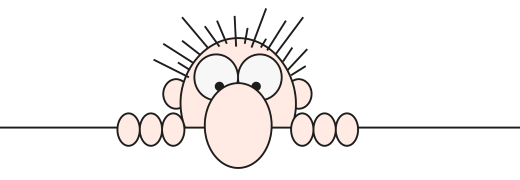

<h2 align="center" style="margin-top: 0;">A passionate Web developer 👨‍💻 from भारत (India)</h2>

- 🔭 I’m currently working on **TypeScript**
  
- 🌱 I’m currently learning **ReactJS , Python**
  
- 👯 I’m looking to collaborate in **any area related to Web-Development**

- 🤝 I’m looking for help with **Learning Back-end** 

- 👨‍💻 All of my projects are available <a href="https://tyagi-achint.github.io" target="_blank" >here</a>.

- 🗣️ I Speak **English, Hindi**

- 💬 Ask me about **Front-end, Designing** 

- 📫 How to reach me **achinttyagi001@gmail.com** 

- 📄 Know about my experiences <a href="https://tyagi-achint.github.io" target="_blank" >here</a>

- ⚡ Fun fact **I think I am creative with colors**

<h3 align="left">Connect with me:</h3>

 &nbsp;&nbsp;&nbsp;&nbsp; &nbsp;&nbsp;&nbsp;&nbsp; 

<h3 align="left">Languages and Tools:</h3>

&nbsp;&nbsp;&nbsp;&nbsp;
&nbsp;&nbsp;&nbsp;&nbsp;
&nbsp;&nbsp;&nbsp;&nbsp;
&nbsp;&nbsp;&nbsp;&nbsp;

&nbsp;&nbsp;&nbsp;&nbsp;
&nbsp;&nbsp;&nbsp;&nbsp;
&nbsp;&nbsp;&nbsp;&nbsp;
&nbsp;&nbsp;&nbsp;&nbsp;
  

  

<b>My GitHub Stats</b>

  
